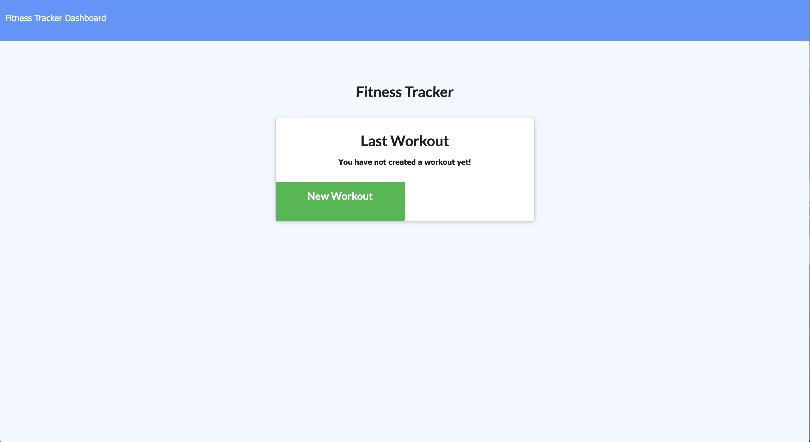
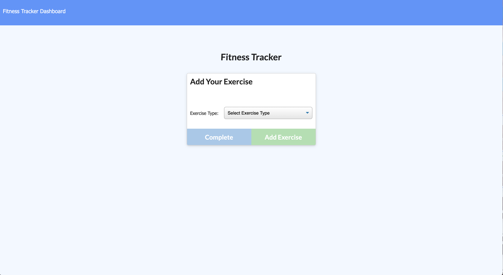
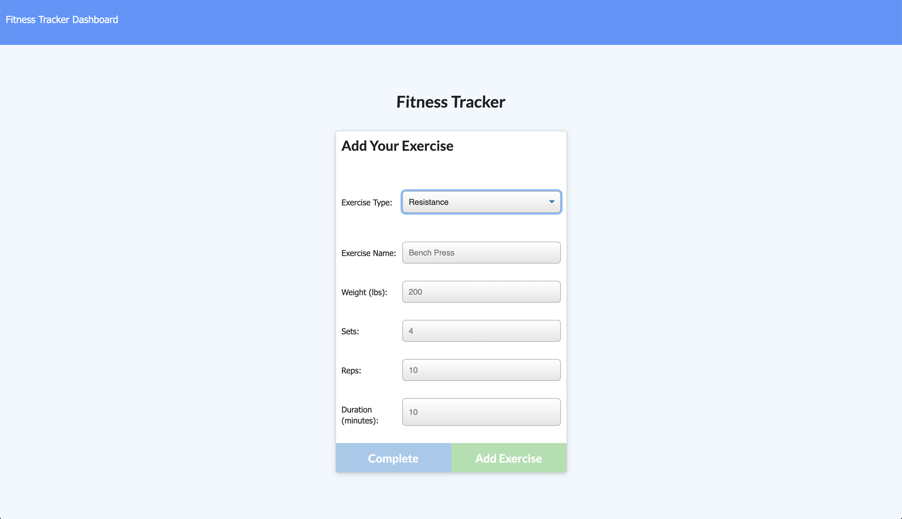
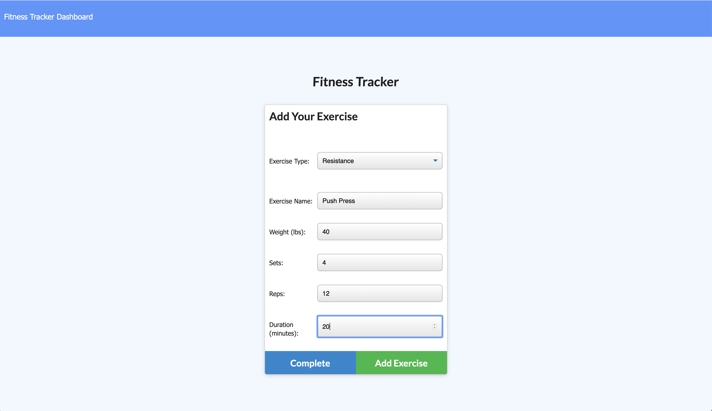
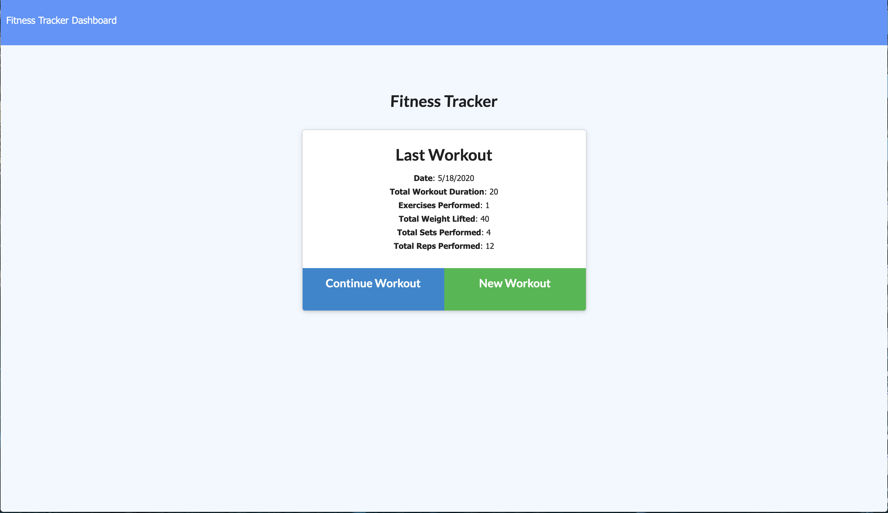
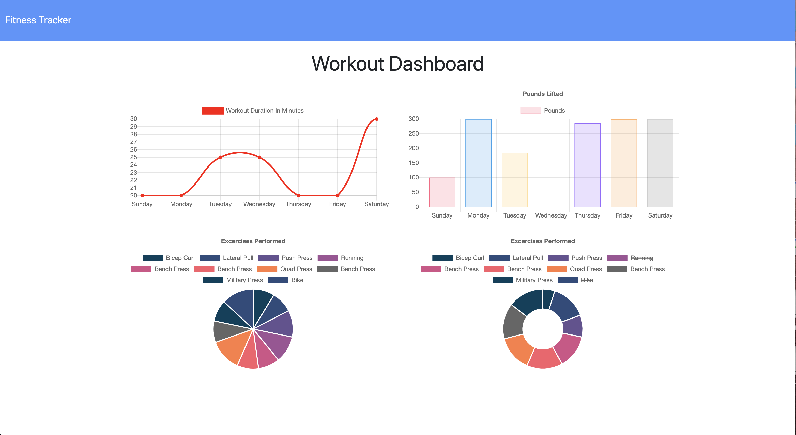

# opus17_noSQL-workout-tracker

  

## Description

Being able to record wokrouts for reaching fitness goals. This app allows a user to create a new workout or add to the latest one. The name, type, weight, sets, reps, and duration are recorded for resistance training. For cardio, the distance is recorded, as well as duration. The user is able to view their stats on the `stats` page.

## Table of Content

* [Installation](#installation)

* [Repository](#repository)

* [Deployment](#deployment)

* [Usage](#usage)

* [License](#license)

* [Contributing](#contributing)

* [Tests](#tests)

* [Questions](#questions)

## Installation

There is no need to install anything at this time. This is an online application.

## Repository

This project's repository is at: [opus17_noSQL-workout-tracker](https://github.com/AJFree458/opus17_noSQL-workout-tracker)

## Deployment

This application is currently deployed through [Workout Tracker on Heroku](https://quiet-crag-10565.herokuapp.com/).

## Usage

To use this application, go to the deployed web page. This is how it looks with no workouts added.

Click on the `New Workout` button to bring up the page to add workouts.

When you select the workout type from the pull down menu it will look like this:

Add in the information that you wish to input.

When you click the `Add Exercise` or `Complete` buttons, you can see it displayed on the main page.

As you add more, there will be more information to display in the `Stats` page.

## License

This project is under the MIT license.

## Contributing

Please report issues and concerns. Fork the repo if desired, and do requests.

## Credit

Main Contributor: Arthur Freeman

## Tests

At this time, there are no tests to be run.

## Questions

If you have any questions about the repo, open an issue or contact [AJFree458](https://api.github.com/users/AJFree458) directly at rthr.frmn@gmail.com.